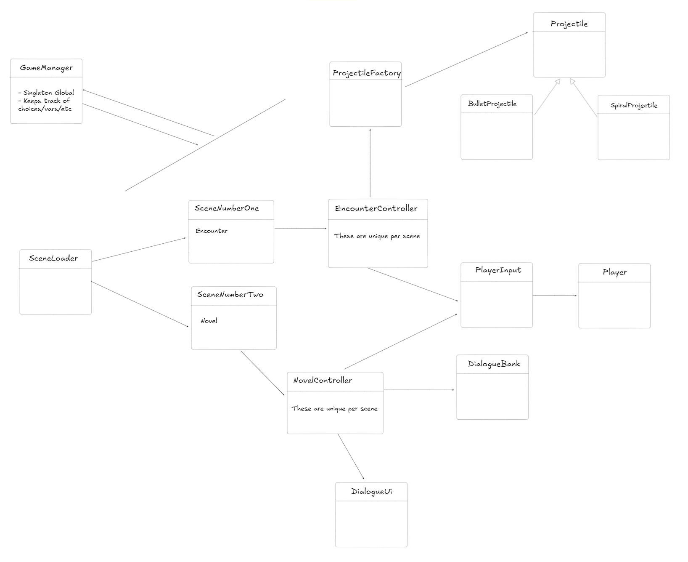

# High Level UML

Last Updated October, 9, 2024

## Overview

This is the high level diagram for Panic Building to properly visualize and organize
how classes should relate to each other.

## GameManager

This class will manage the overall game state, keeping track of which stage the player is currently on.

## SceneLoader

SceneLoader will be transitioning between scenes and loading scenes.

## EncounterController

EncounterController will be unique per scene and control the projectile patterns as well as clear condition for the level.

## NovelController

NovelController will be unique per scene and be the controller between
DialogueBank and DialogueUI managing which dialogue is displayed.

## DialogueBank

DialogueBank will store the dialogue, currently a .txt file.

## DialogueUI

DialogueUI will display the dialogue pulled from DialogueBank.

## ProjectileFactory

ProjectileFactory is the class that produces projectiles. This is where projectile patterns can be defined.

## Projectile

Projectile will store the ability for projectiles to move and how much damage they deal.

## PlayerInput

PlayerInput will control the player's movement and animations.

## Player

Player is the object the user of the game controls. It will store health for the player.
